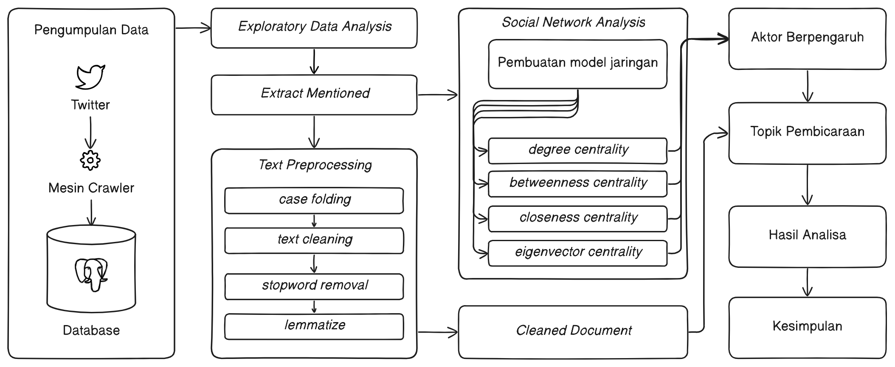

# Catatan

**Outline Presentasi :**

1. Pendahuluan - menjelaskan tentang coldplay yang kemudian dikaitkan dengan SNA hingga melakukan ekstraksi topik pada akun teratas
2. Metodologi Penelitian - berisikan tentang tahapan yang dilakukan selama meneliti
3. *Skenario pengujian - ==berisikan tentang skenario yang sudah dibuat (?)==*
4. Hasil dan analisis - berisikan tentang
5. Kesimpulan dan saran - berisikan tentang

## Alur Penelitian

