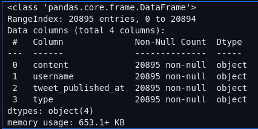
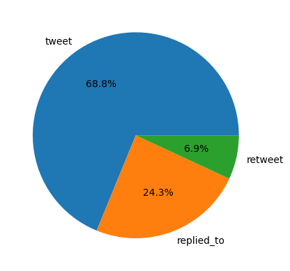
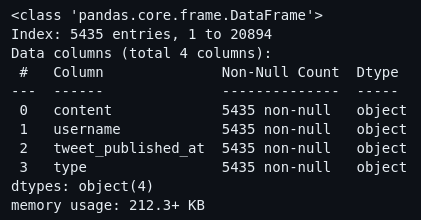
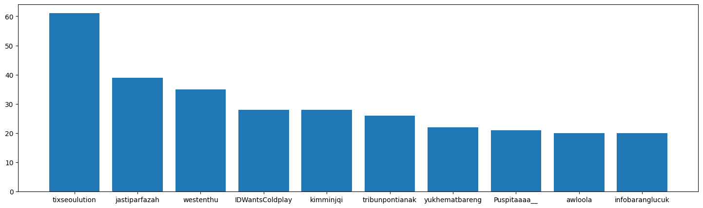
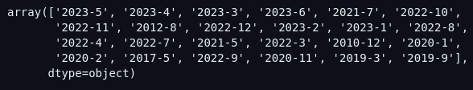
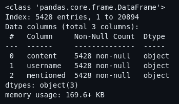

# Hasil Exploratory Data Analysis (EDA)
> author: kurniawan ronaldi purnama

Data yang ada merupakan data hasil crawling dari twitter dengan menggunakan keyword `"coldplay"`. hasil data sebagai berikut :

dari gambar tersebut tertera bahwa ==terdapat **20895** baris data== dengan attribut 
1. content - data merupakan content twitter
2. username - data merupakan username akun twitter yang memposting tweet tersebut
3. tweet_published_at - kapan twitter tersebut diposting
4. type - jenis twitternya `('tweet', 'retweet', 'replied_to')`

jika melihat rasio perbandingan data berdasarkan jenis twitternya dapat terlihat sebagai berikut :

mayoritas data merupakan `tweet`, ==bisa jadi tweet tersebut hanyalah cuitan tanpa melakukan mention dengan seseorang==. sedangkan untuk `retweet` dan `replied_to` sudah dipastikan pengguna tersebut memposting tweet dengan ==melakukan mention terhadap pengguna lain==.

## Melakukan filterisasi 
tujuan melakukan filter disini ==untuk memilah data tweet yang mengandung mention==. 

filterirasi dilakukan dengan mengambil data bagian content kemudian mengecek apakah terdapat karakter `@`. disini saya menggunakan regex untuk memfilter, regex tersebut:
```regex
(\@\w+)
```
maksud dari regex tersebut adalah mengambil kelompok kata yang mengandung `@` ditambah huruf alphanumeric setelahnya. artinya mengambil username yang dimention oleh author postingan tersebut.



dari hasil filterisasi tersebut ditemukan bahwa ==data tersisa **5435** baris data==.

jika melihat rasio persebaran datanya setelah difilter dapat terlihat sebagai berikut :


hasil persebaran data tersebut langsung berubah drastis, terlihat bahwa mayoritas data sekarang hanyalah data berjenis `replied_to`.

dengan begitu ==hasil dari data yang tersisa merupakan interaksi antar pengguna, dibandingkan jika data tidak dilakukan filterisasi==.

## Mengambil user yang paling banyak melakukan tweet
dengan mengambil nama pengguna yang paling banyak melakukan mention, kita ==bisa memperkirakan bahwa ada kemungkinan dari pengguna ini akan menjadi aktor teratas setelah dilakukan analisa **Social Network Analysis**==.



disini saya mengambil hanya 10 pengguna teratas berdasarkan frekuensi tweet terbanyak. dan didapatkan pengguna sebagai berikut :
| | |
| --- | --- |
| 1. tixseoulution | 6. tribunpontianak |
| 2. jastiparfazah | 7. yukhematbareng |
| 3. westenthu | 8. Puspitaaaa__ |
| 4. IDWantsColdplay | 9. awloola |
| 5. kimminjqi | 10. infobaranglucuk |
| | |

## Filter kelompok data berdasarkan tanggal unik
melakukan pengecekan kelompok data dengan mengambil tanggal unik menggunakan format `YYYY-mm`. disini melakukan filterirasi data lagi yang berbeda dengan sebelumnya, sehingga ==data yang diimplementasikan filternya merupakan data awal yang berjumlah **20895**==.



didapatkan bahwa ternyata masih ada data yang terambil selain di tahun 2023.

setelah dilakukan filterisasi data yang merupakan tweet tahun 2023 didapatkan jumlah tweet sebagai berikut :

| jumlah data awal | hanya mengambil mentioned | tahun 2023 | menggabungkan kedua filter |
| --- | --- | --- | --- | 
| 20895 | 5428 | 20864 | 5428 |

> dari hasil filterisasi data yang dilakukan, data akan difilter hanya baris data tweet pada attribut content yang memiliki mentioned.

hasil dari explorasi data didapatkan featuring data sebagai berikut :



terdapat **5428** baris data dengan attribut :
1. content - berisikan teks pesan dari pembuat postingan tweet
2. username - nama pengguna atau pembuat tweet
3. mentioned - berisikan nama - nama pengguna twitter yang disebut oleh pembuat postingan