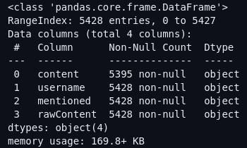

# Hasil pembuatan Model Graph Social Network Analysis
untuk membuat struktur jaringan social network analysis berdasarkan hasil data dari proses **EDA**. dengan informasi data sebagai berikut :

maka kita dapat memanfaatkan attribut `username` dan `mentioned` untuk membuat edges pada suatu jaringan. dengan memanfaatkan bantuan library `networkx`.

## Membentuk edges/link
contoh sample data

| username | mentioned |
| --- | --- |
| Dwiky_alfi | [@0tk0il] |
| ... | ... |
| yuhuaha | [@ILHAM_AVEIRO1, @vanry12, @0tk0il] |

dengan menggunakan sampel data seperti diatas maka dapat membentuk edges kurang lebih sebagai berikut :

| source | target | weight |
| --- | --- | --- |
| Dwiky_alfi | 0tk0il | 1 |
| yuhuaha | ILHAM_AVEIRO1 | 1 | 
| yuhuaha | vanry12 | 1 |
| yuhuaha | 0tk0il | 1 |

hanya dengan membentuk nodes maka library `networkx` akan secara otomatis mengenalinya sebagai 2 node. sehingga daftar node akan dikenali sebagai berikut :

| id |
| --- |
| Dwiky_alfi |
| 0tk0il |
| yuhuaha |
| ILHAM_AVEIRO1 |
| vanry12 |
| 0tk0il |

